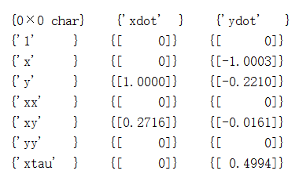

# Sindy拓展
* 时滞
* 随机
* 指数
  
# 要如何根据需要添加这些项呢？
>在Steven Brunton教授给出的包内，`poolData`是一 个十分重要的函数。通过对其进行修改可以将`sindy`所能识别的系统拓广。

## **1.时滞**
```matlab
function yout = poolData(yin,nVars,polyorder,usesine,delay)

...

if(polyorder>=3)
    % poly order 3
    for i=1:nVars
        for j=i:nVars
            for k=j:nVars
                yout(:,ind) = yin(:,i).*yin(:,j).*yin(:,k);
                ind = ind+1;
            end
        end
    end
end
```

我们要引入时滞项则需要添加一个`xtau`,我给出的添加方式如下：
```matlab
if(delay)
    %构造时滞项
    xtau = zeros(length(yin),1);
    xtau(delay+1:end) = yin(1:length(yin)-delay,1);
    yout(:,ind) = xtau;
    ind =ind + 1;
end
```
这里我们要引入一个新的参数`delay`,要注意的是，这里的`delay`与时滞$\tau$有区别，`delay`必须为整数，其为离散情形下的时间延迟。

`poolData`得到后就可以直接计算`Xi`,即系数矩阵。

为了便于观察，要对`poolDataList`进行修改，添加如下语句：
```matlab
if(delay)
    yout{ind,1}=['xtau'];
    ind = ind+1;
end
```
>例1
>
>待识别方程
>>
>>$\frac{dx}{dt} = y+0.27 xy$
>>
>>$\frac{dy}{dt}=  -x-0.2213 y + 0.5 x_{\tau}-0.0171 xy$
>>

>
>所得结果如下:
>
>`Xi`矩阵
>
>
>
>相图
>

 整个修改的过程，因为涉及到`xtau`，不能再使用ode45求解，需要自己重新定义[`sparseGalerkin`](https://gitee.com/cpress706/matlab-sindy/blob/master/sparsedynamics/utils/sparseGalerkin.m)函数
 ```matlab
function [f,g] = sparseGalerkin(yin,ahat,polyorder,usesine,delay)
nVars =length(yin);
yout = [];
for i=1:nVars
    yout = [yout,yin(:,i)];
end

if(polyorder>=2)
    % poly order 2
    for i=1:nVars
        for j=i:nVars
            yout =  [yout,yin(:,i).*yin(:,j)];
        end
    end
end

if(polyorder>=3)
    % poly order 3
    for i=1:nVars
        for j=i:nVars
            for k=j:nVars
                yout =  [yout,yin(:,i).*yin(:,j).*yin(:,k)];
            end
        end
    end
end

if(polyorder>=4)
    % poly order 4
    for i=1:nVars
        for j=i:nVars
            for k=j:nVars
                for l=k:nVars
                    yout= [yout,yin(:,i).*yin(:,j).*yin(:,k).*yin(:,l)];
                    ind = ind+1;
                end
            end
        end
    end
end

if(polyorder>=5)
    % poly order 5
    for i=1:nVars
        for j=i:nVars
            for k=j:nVars
                for l=k:nVars
                    for m=l:nVars
                        yout = [yout,yin(:,i).*yin(:,j).*yin(:,k).*yin(:,l).*yin(:,m)];
                        ind = ind+1;
                    end
                end
            end
        end
    end
end
if(usesine)
    for k=1:10;
        yout = [yout sin(k*yin) cos(k*yin)];
    end
end
%%
syms x1tau GSN1 GSN2
if(delay)
    f = ([1,yout,x1tau]*ahat(:,1));
    g = ([1,yout,x1tau]*ahat(:,2));
else
    f =  ([1,yout]*ahat(:,1));
    g =  ([1,yout]*ahat(:,2));
end
f = eval(['@(x1tau,GSN1,GSN2,x1,x2)',vectorize(f)]);
g = eval(['@(x1tau,GSN1,GSN2,x1,x2)',vectorize(g)]);
```
之所以要定义为`@(vars)function`的形式，是由于时滞项的存在，在求解时采用了自定义的[`Runge_Kutta`](https://gitee.com/cpress706/matlab-sindy/blob/master/code_delay/Runge_Kutta.m)函数，为了和[`Runge_Kutta`](https://gitee.com/cpress706/matlab-sindy/blob/master/code_delay/Runge_Kutta.m)函数的参数形式保持一致，要写成这种句柄形式的。

需要注意到的，这里的`xtau`是单独的，没有与其它元素组合。

## **2.指数**
和加入时滞项的方法一致，修改`poolData`函数：
```matlab
if(usee)
    %构造指数项
    ex1 = exp(yin(:,1));
    ex2 = exp(yin(:,2));
    yout(:,ind:ind+1) = [ex1,ex2];
    ind =ind + 2;
end
```
这里只构造了两项，根据需要进行增加。
`poolDataList`函数也要镶银的修改，如下：
```matlab
if(usee)
    yout{ind,1} = ['ex1'];
    yout{ind+1,1} = ['ex2'];
    ind = ind+2;
end
```
>例2
>待识别方程为
>>$\frac{dx}{dt}=y + w_1$
>>
>>$\frac{dy}{dt}=5-e^x+x^2+w_2$
>
>识别结果如下：
>
>`Xi`矩阵
>
>
>
>相图及时间历程图
>
>
>
>

仍然需要自己重新定义[`sparseGalerkin`](https://gitee.com/cpress706/matlab-sindy/blob/master/sparsedynamics/utils/sparseGalerkin.m)函数
```matlab
function [f,g] = sparseGalerkin(yin,ahat,polyorder,usesine,delay,usee)

...

syms x1tau GSN1 GSN2
if(usee)
    f = ([1,yout,exp(yin(1)),exp(yin(2))]*ahat(:,1));
    g = ([1,yout,exp(yin(1)),exp(yin(2))]*ahat(:,2));
else
    f =  ([1,yout]*ahat(:,1));
    g =  ([1,yout]*ahat(:,2));
end
f = eval(['@(x1tau,GSN1,GSN2,x1,x2)',vectorize(f)]);
g = eval(['@(x1tau,GSN1,GSN2,x1,x2)',vectorize(g)]);
```
## **3.随机**

>参考
>
>[Nonlinear stochastic modeling with Langevin regression](https://gitee.com/programming-literacy-institute/langevin-regression)
>
>[Sparse learning of stochastic dynamic equations](reference/1712.02432.pdf)